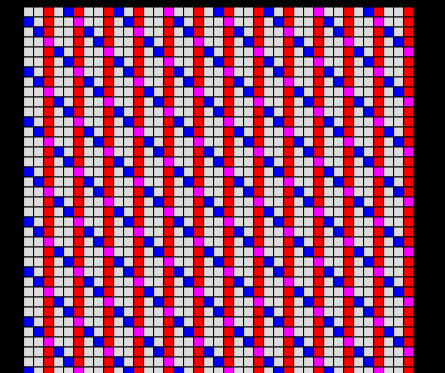
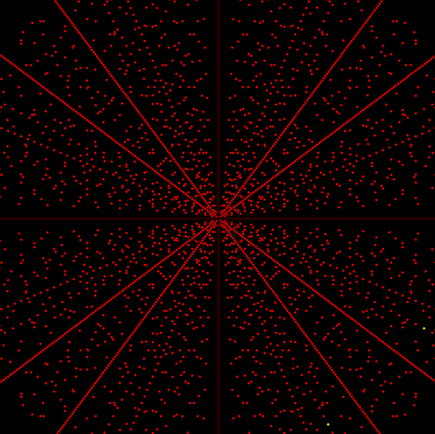
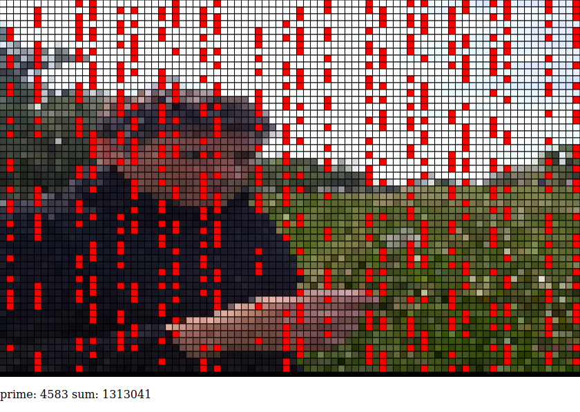
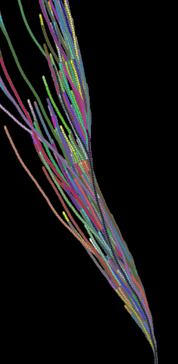

# project-euler
a place to hold some code inspired by projecteuler.net 

code in python to solve the problems

code in p5js to visualize it in a more creative way.

----

## Problem 1:

[see it live here](https://editor.p5js.org/greggelong/full/2L_umf2pF)

Some fun with projecteuler.net. The site gives you “a series of challenging mathematical/computer programming problems that will require more than just mathematical insights to solve.” I solved problem one in #python3 and entered the result, which is a 6 digit number, which I am not showing because they request that you don’t share. But in addition to just a text based solution I have also visualized problem 1 using #p5js. The problem: Find the sum of all the multiples of 3 or 5 below 1000. Here multiples of 3 are red, multiples of 5 are blue, multiples of both are purple, and white are not multiples. All this plotted on a grid that varies in size from 30 to 45. I didn’t visualize the sum. I think it makes a nice pattern.

---------

## Problem 9

[see it live here](https://editor.p5js.org/greggelong/full/H8vWIW8Eh)

Another visualization of a projecteuler.net problem. In #p5js This is problem nine. “A Pythagorean triplet is a set of three natural numbers, a < b < c, for which,
a^2 + b^2 = c^2
For example, 3^2 + 4^2 = 9 + 16 = 25 = 5^2.
There exists exactly one Pythagorean triplet for which a + b + c = 1000.
Find the product abc.” The solutions for triples that equal 1000 are the two yellow dots at the bottom right of the first picture. Why are there two solutions when it says there should be one? Well, I have plotted the ‘a’ and ‘b’ as ‘x’ and ‘y’ so my brute force included when the values of ‘a’ and ‘b’ are swapped. I first solved it in python using the Diophantus method which I read about in Ian Stewarts book “Cabinet of Mathematical Curiosities” the p5js version is just brute force with for loops. #creativecoding

--------

## Problem 10
Summation of Primes

[see it live here](greggelong.github.io\euler10)

--------
## Problem 14

[see it live here](https://editor.p5js.org/greggelong/full/-sftBhRjb)

[see it live here](https://editor.p5js.org/greggelong/full/vbbr7vJhJ)

Getting a little philosophical while continuing to solve and then visualize Project Euler problems. This is problem 14, Longest Collatz sequence for a number under 1 million. (Not giving the solution here). I solved it in Frankfurt airport waiting to board the plane to Shanghai where I have started a 14 day quarantine (Oct. 28th 2020), before continuing back to Beijing. I have visualized the problem in #p5js somewhat unoriginally but animated each branch. Some branches are winding this way and that. Others follow well worn paths pulsating with random colors. This reminds me of odd branches that this year took leaving us to live in Serbia for 8 months, and the bureaucratic puzzles we had to solve to get back to China. The visualisation looks a bit natural and yet artificial. This reminds me of the very natural environment I enjoyed in Serbia, which is very different from the manufactured environments of the megacities in China. What's more, there is the impression of order in chaos. The Collatz conjecture states that all numbers will reach 1 if subject to the operations, if even divide by 2, if odd multiply by 3 and add 1. As for me, what keeps the order in my life? There are similar operations of a few good habits, love and study which help my life’s path to converge to something good. #collatz There are some good #numberphile videos on the Collatz conjecture and a coding challenge on #thecodingtrain. I have approached the code a little differently than the coding train video. But the visualisation method is roughly the same.
